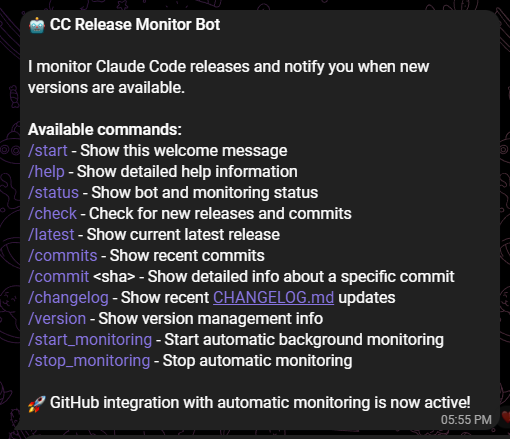
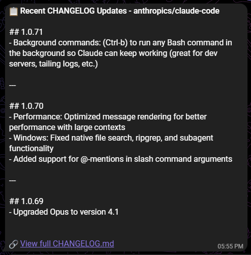

# CC Release Monitor - Telegram Bot

A locally-hosted Telegram bot that monitors the `anthropics/claude-code` repository for new commits and changelog updates, sending automatic notifications when changes are detected.

## 🚀 Features

- **GitHub Integration**: Monitors commits and changelog updates
- **Telegram Notifications**: Automatic alerts for new changes
- **Local Hosting**: No cloud dependencies, runs on your machine
- **Cost Effective**: Uses GitHub's free API tier (5,000 requests/hour)
- **User Control**: Start/stop monitoring with simple commands

## ⚙️ Setup

### Prerequisites
- Python 3.9+ (Miniconda/Anaconda recommended)
- Telegram Bot Token (from @BotFather)
- GitHub Personal Access Token (optional, for higher rate limits)

### Installation

1. **Clone the repository**
   ```bash
   git clone <repository-url>
   cd CC-Release-Monitor
   ```

2. **Install dependencies**
   ```bash
   pip install -r requirements.txt
   ```

3. **Configure environment variables**
   ```bash
   copy .env.example .env
   # Edit .env file with your tokens
   ```

4. **Start the bot**
   ```bash
   # Option 1: Using Python directly
   python simple_bot.py
   
   # Option 2: Using the launcher (Windows)
   start_bot.bat
   ```

## 🤖 Bot Commands

### Basic Commands
- `/start` - Welcome message and command overview
- `/help` - Detailed help information
- `/status` - Bot status and monitoring info

### Monitoring Commands
- `/check` - Manually check for new commits/releases
- `/commits` - Show recent commits from repository
- `/changelog` - Display recent CHANGELOG.md updates
- `/commit <sha>` - Show detailed info about specific commit

### Automatic Monitoring
- `/start_monitoring` - Enable automatic background checking
- `/stop_monitoring` - Disable automatic monitoring

## 📸 Screenshots

### Bot Welcome Screen


### Bot Commands in Action


## 📊 API Usage

The bot makes approximately:
- **3 API calls every 30 minutes** (when monitoring is active)
- **144 calls per day** (well within GitHub's free tier)
- **~4,320 calls per month** (less than 3% of the 5,000/hour limit)

## 🏠 Local Hosting Benefits

- **Complete Privacy**: No data leaves your machine
- **Zero Costs**: No monthly fees or cloud charges
- **Full Control**: Start/stop monitoring as needed
- **Reliable**: No dependency on external services

## 🔧 Configuration

Key settings in `.env`:
```env
TELEGRAM_BOT_TOKEN=your_bot_token_here
GITHUB_API_TOKEN=your_github_token_here  # Optional but recommended
GITHUB_REPO=anthropics/claude-code
CHECK_INTERVAL_MINUTES=30
```

## 📁 Project Structure

```
CC-Release-Monitor/
├── src/
│   ├── config.py           # Configuration management
│   ├── github_client.py    # GitHub API integration
│   ├── version_manager.py  # Version tracking and storage
│   └── release_parser.py   # Release data parsing
├── data/                   # Runtime data storage
├── logs/                   # Application logs
├── tests/                  # Test suite
├── simple_bot.py          # Main bot implementation
├── start_bot.bat          # Windows launcher
├── requirements.txt       # Python dependencies
├── .env.example          # Environment template
└── README.md             # This file
```

## 🚀 Quick Start (Windows)

1. Double-click `start_bot.bat`
2. Wait for "Scheduler started!" message
3. Message your bot on Telegram
4. Send `/start_monitoring` to begin automatic notifications

## 🛠️ Troubleshooting

### Common Issues

**Bot won't start:**
- Check Python path in `start_bot.bat`
- Verify all dependencies are installed: `pip install -r requirements.txt`

**No notifications:**
- Ensure monitoring is enabled: `/start_monitoring`
- Check bot token in `.env` file
- Verify bot is running (don't close the terminal)

**GitHub API errors:**
- Add GitHub token to `.env` for higher rate limits
- Check token permissions (no scopes needed for public repos)

## 📱 Usage Example

1. Start bot with `start_bot.bat`
2. Find your bot on Telegram
3. Send `/start` to see available commands
4. Send `/start_monitoring` to enable automatic checking
5. Bot will notify you when Claude Code commits or changelog updates occur

## 🔄 Updates

The bot automatically tracks:
- New commits to the main branch
- Changes to CHANGELOG.md
- Any future GitHub releases (if they start using releases)

## 📞 Support

For issues or questions:
1. Check the logs in the `logs/` directory
2. Use `/status` command to check bot health
3. Restart bot if needed: Stop with Ctrl+C, run `start_bot.bat` again