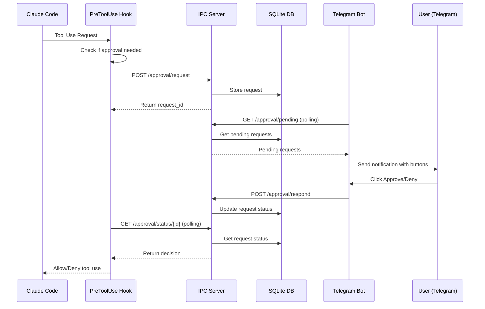

# Remote Approval System - Implementation Summary

## ✅ Successfully Implemented

### Core Components

1. **Approval Queue System** (`src/models/approval.py`)
   - SQLite-based persistent storage
   - Full CRUD operations for approval requests
   - Automatic timeout handling
   - Statistics and cleanup functions

2. **IPC Server** (`src/ipc_server.py`)
   - FastAPI-based HTTP server on port 8765
   - RESTful endpoints for request/response flow
   - WebSocket support for real-time notifications
   - Health check and statistics endpoints

3. **Claude Code Hook** (`.claude/hooks/remote_approval.py`)
   - Intercepts PreToolUse events
   - Smart filtering (auto-approves safe operations)
   - Timeout handling with fallback to local approval
   - Comprehensive logging

4. **Telegram Bot Integration** (`src/bot_approval.py`)
   - Inline keyboard interface for approve/deny
   - Custom denial reasons
   - Background monitoring for new requests
   - Statistics and status commands

5. **Enhanced Bot** (`remote_bot.py`)
   - Combines release monitoring with approval system
   - Runs IPC server in background thread
   - Unified command interface

## Key Features

### Security & Authorization
- ✅ User authorization via Telegram User IDs
- ✅ Session isolation for requests
- ✅ Audit logging of all decisions
- ✅ Timeout protection (55 seconds)

### User Experience
- ✅ Mobile-friendly Telegram interface
- ✅ Detailed request information
- ✅ Inline approval buttons
- ✅ Custom denial reasons
- ✅ Real-time notifications

### Smart Filtering
- ✅ Auto-approves safe tools (Read, Grep, LS)
- ✅ Auto-approves safe commands (ls, pwd, echo)
- ✅ Requires approval for dangerous operations
- ✅ Configurable approval rules

## How It Works



## Usage Instructions

### Quick Start

1. **Install dependencies:**
   ```bash
   pip install -r CC-Release-Monitor/requirements.txt
   ```

2. **Configure `.env`:**
   ```env
   TELEGRAM_BOT_TOKEN=your_token
   AUTHORIZED_USERS=your_telegram_id
   ```

3. **Start the system:**
   ```bash
   python remote_bot.py
   ```

4. **In Telegram:**
   - Send `/start` to get your User ID
   - Send `/start_approval` to enable monitoring

5. **In Claude Code:**
   - The hook automatically activates for this project
   - Try running a command to test

### Available Commands

**Telegram Bot:**
- `/start` - Initialize and get User ID
- `/start_approval` - Enable approval monitoring
- `/stop_approval` - Disable approval monitoring  
- `/approval_status` - View statistics

**Approval Actions:**
- ✅ Approve - Allow the action
- ❌ Deny - Block with default reason
- 📝 Deny with Reason - Provide custom feedback
- ℹ️ Details - View full request information

## File Structure

```
CC-Release-Monitor/
├── .claude/
│   ├── hooks/
│   │   └── remote_approval.py      # Claude Code hook
│   └── settings.json               # Hook configuration
├── src/
│   ├── models/
│   │   └── approval.py            # Approval request models
│   ├── bot_approval.py            # Telegram bot handlers
│   └── ipc_server.py              # IPC communication server
├── data/
│   └── approvals.db               # SQLite database
├── remote_bot.py                  # Main bot with approval
├── start_remote_bot.bat           # Windows launcher
└── REMOTE_APPROVAL_SETUP.md       # Setup documentation
```

## Configuration Files

### `.claude/settings.json`
Configures Claude Code to use the approval hook for all tools.

### `.env`
Contains bot token and authorized user IDs.

### Hook Configuration
In `remote_approval.py`, customize:
- `SENSITIVE_TOOLS` - Tools requiring approval
- `SAFE_TOOLS` - Auto-approved tools
- Safe command patterns

## Testing

The system can be tested at multiple levels:

1. **Hook Testing:**
   ```bash
   echo '{"session_id":"test","tool_name":"Bash","tool_input":{"command":"echo test"}}' | python .claude/hooks/remote_approval.py
   ```

2. **IPC Server Testing:**
   ```bash
   curl http://localhost:8765/approval/stats
   ```

3. **End-to-End Testing:**
   - Start bot
   - Enable approval monitoring
   - Trigger tool use in Claude Code
   - Approve/deny via Telegram

## Benefits

1. **Remote Control:** Manage Claude Code from anywhere
2. **Security:** Additional approval layer for sensitive operations
3. **Flexibility:** Customizable approval rules
4. **Audit Trail:** Complete logging of all decisions
5. **Mobile Friendly:** Full control from phone
6. **Fallback:** Graceful degradation if server unavailable

## Future Enhancements

- Pattern-based auto-approval rules
- Batch approval for similar requests
- Voice command support
- Session management controls
- Real-time output streaming
- Web dashboard for analytics

## Troubleshooting

Common issues and solutions:

1. **Bot not receiving notifications:**
   - Check IPC server is running (port 8765)
   - Verify hook file exists and is executable
   - Check logs in `~/.claude/hooks/`

2. **"Not authorized" errors:**
   - Get User ID with `/start`
   - Add to `AUTHORIZED_USERS` in `.env`
   - Restart bot

3. **Requests timing out:**
   - Ensure Telegram notifications enabled
   - Check network connectivity
   - Adjust `APPROVAL_TIMEOUT_SECONDS`

## Summary

The Remote Approval System successfully transforms the CC Release Monitor bot into a powerful remote control system for Claude Code sessions. It provides a secure, user-friendly way to approve or deny Claude's actions from anywhere using Telegram, with smart filtering, comprehensive logging, and graceful fallback mechanisms.